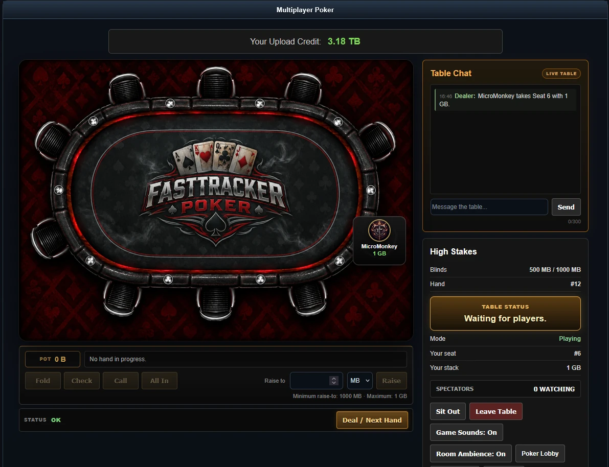
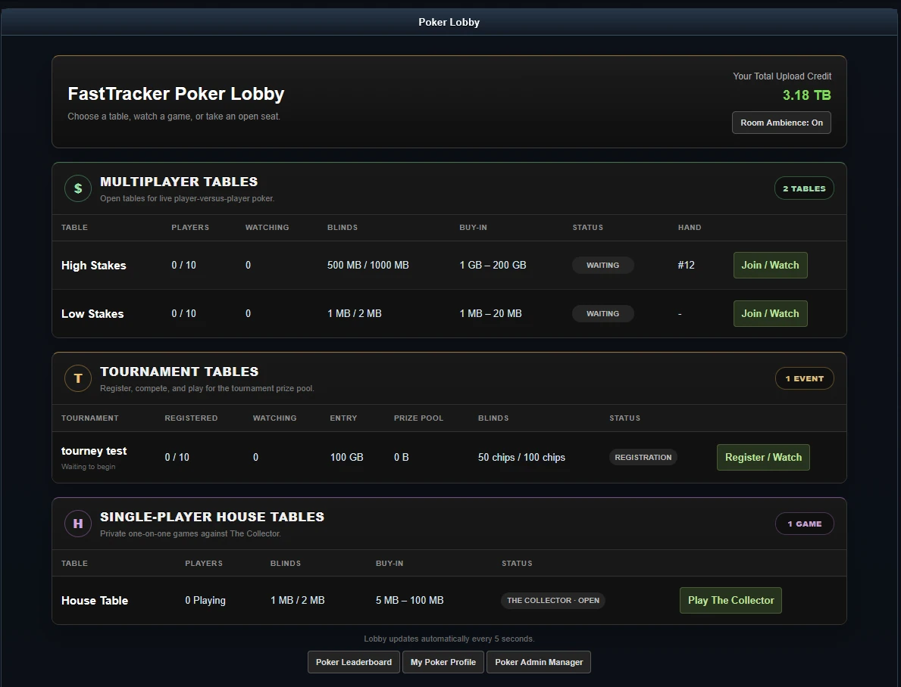
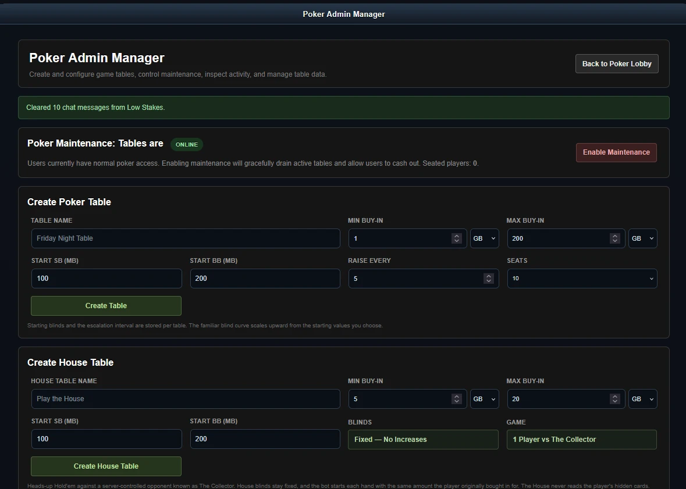

# ♠ FastTracker Poker

A full browser-based Texas Hold'em poker system built for **TorrentTrader / TTv3**.

FastTracker Poker adds multiplayer poker, tournament play, and private single-player games against the house directly to a TorrentTrader community. It integrates with the existing user system and uses tracker **upload credit as poker chips**.

## 🎰 Poker for TorrentTrader

FastTracker Poker was built as an integrated entertainment system for TorrentTrader rather than a standalone poker server.

Players use their existing tracker account and upload credit to buy into games. No separate poker account or virtual currency system is required.

The system provides three different ways to play:

### ♠ Multiplayer Poker

Traditional player-versus-player Texas Hold'em with support for up to **10 players per table**.

Players can take an open seat, buy in using upload credit, chat with the table, watch as spectators, sit out, and compete against other tracker members.

### 🏆 Tournament Poker

Create organized poker tournaments with player registration, entry requirements, prize pools, configurable blinds, player limits, spectators, and administrative tournament controls.

### ☠ The Collector

Don't have anyone online to play against?

Take on **The Collector**.

The Collector is the server-controlled house opponent. Each player receives an independent heads-up game, allowing multiple members to play against the house simultaneously.

The house does not have access to the player's hidden cards.

---

## ✨ Features

- Texas Hold'em poker
- Up to 10 players per multiplayer table
- Multiplayer player-versus-player games
- Tournament poker
- Single-player heads-up games against The Collector
- Existing TorrentTrader account integration
- Upload credit used as poker chips
- MB and GB stakes
- Configurable small and big blinds
- Configurable minimum and maximum buy-ins
- Per-table blind configuration
- Tournament-style blind increases
- Raise-to betting controls
- All-in support
- Player turn countdown
- Automatic fold/check on timeout
- Reconnect grace period
- Sit-out support
- Spectator mode
- Live spectator counts
- Integrated table chat
- Game sounds
- Optional room ambience
- Player statistics
- Poker leaderboard
- Player profiles
- Live poker lobby
- Automatic lobby updates
- Administrative table management
- Tournament administration
- Poker maintenance mode

---

## 🖥 Poker Lobby

The Poker Lobby provides a central view of all available games.

Multiplayer tables, tournaments, and house games are separated into their own sections while still being accessible from one screen.

The lobby displays live information including:

- Players seated
- Spectators watching
- Table blinds
- Buy-in limits
- Current hand
- Table status
- Tournament registration
- Tournament prize pools
- Available upload credit

The lobby automatically refreshes table information while the player remains on the page.

---

## 💰 Upload Credit as Poker Chips

FastTracker Poker integrates directly with the TorrentTrader upload-credit economy.

A member's existing upload credit becomes their available poker bankroll.

This allows tables ranging from extremely small MB games to high-stakes GB games without introducing a second currency system.

Administrators can configure each table's:

- Small blind
- Big blind
- Minimum buy-in
- Maximum buy-in
- Number of seats
- Blind escalation

Players cannot wager more credit than they have committed to the table.

---

## 🎮 Multiplayer Tables

The poker table provides the complete game interface, including:

- Player seats and stacks
- Community cards
- Pot display
- Fold, check, call, raise and all-in controls
- Raise-to wagering
- Current hand information
- Table status
- Player upload-credit balance
- Table chat
- Spectator information
- Sit-out controls
- Game sounds
- Room ambience
- Direct return to the Poker Lobby

Games update dynamically without requiring players to manually reload the page.

---

## 👁 Spectator Mode

Members can watch active multiplayer and tournament tables without occupying a seat.

The number of spectators is displayed directly in the table and lobby interfaces.

Spectators can follow the game and take an available seat when appropriate.

---

## 💬 Table Chat

Each multiplayer poker table includes its own integrated chat.

Players can communicate without leaving the game, while administrative controls allow poker staff to clear table chat when necessary.

---

## 🔊 Sounds & Ambience

Poker includes game sounds and optional room ambience to give tables more of a casino-room atmosphere.

Players can independently enable or disable:

- Game sounds
- Room ambience

These controls are available directly from the poker interface.

---

## 🏆 Player Statistics & Leaderboard

FastTracker Poker includes persistent player statistics and a site-wide poker leaderboard.

Members can view their poker profile and compare their performance with other players in the community.

---

## 🔧 Poker Administration

The integrated **Poker Admin Manager** provides centralized control over the poker system.

Administrators can:

- Create multiplayer tables
- Create house tables
- Configure table names
- Configure minimum and maximum buy-ins
- Select MB or GB buy-in units
- Configure starting blinds
- Configure blind escalation
- Configure player capacity
- Manage tournaments
- Start tournaments
- Clear table chat
- Inspect poker activity
- Delete tables
- Enable or disable poker maintenance mode

### Maintenance Mode

Maintenance mode allows administrators to take the poker system offline without abruptly terminating active games.

When maintenance is enabled, existing tables can gracefully drain so players have an opportunity to finish their games and cash out.

---

## 🖥 Requirements

FastTracker Poker is designed for integration with a **TorrentTrader / TTv3** installation.

Typical requirements include:

- PHP 7.4+
- PHP 8.x compatible
- MySQL or MariaDB
- MySQLi
- JavaScript-enabled modern desktop browser
- Existing TorrentTrader user authentication
- Existing TorrentTrader upload-credit system

The poker system is intended primarily for desktop use.

---

## 📦 Installation

FastTracker Poker is an integrated TorrentTrader module and expects access to the existing TorrentTrader environment.

General installation consists of:

1. Copy the poker files into the TorrentTrader installation.
2. Import the supplied poker SQL schema into the TorrentTrader database.
3. Install the supplied poker images and audio assets.
4. Verify the TorrentTrader database and authentication includes.
5. Configure the required poker administrator permission level.
6. Open the Poker Admin Manager.
7. Create the desired multiplayer, tournament, and house tables.

### Database Installation

Database schema changes are supplied as SQL and should be imported manually.

**FastTracker Poker does not automatically create its database tables from PHP.**

This keeps database changes explicit and allows the site administrator to review the schema before installation.

---

## 🔒 Intended Use

FastTracker Poker was created as an entertainment feature for private TorrentTrader communities.

Poker chips represent tracker upload credit only.

**Upload credit and poker chips have no real-world monetary value.**

---

## 📸 Screenshots

### Poker Lobby

### Multiplayer Table

### Poker Admin Manager

---

## ♥ FastTracker Poker

**Multiplayer. Tournaments. The Collector.**

Built for **TorrentTrader / TTv3**.
